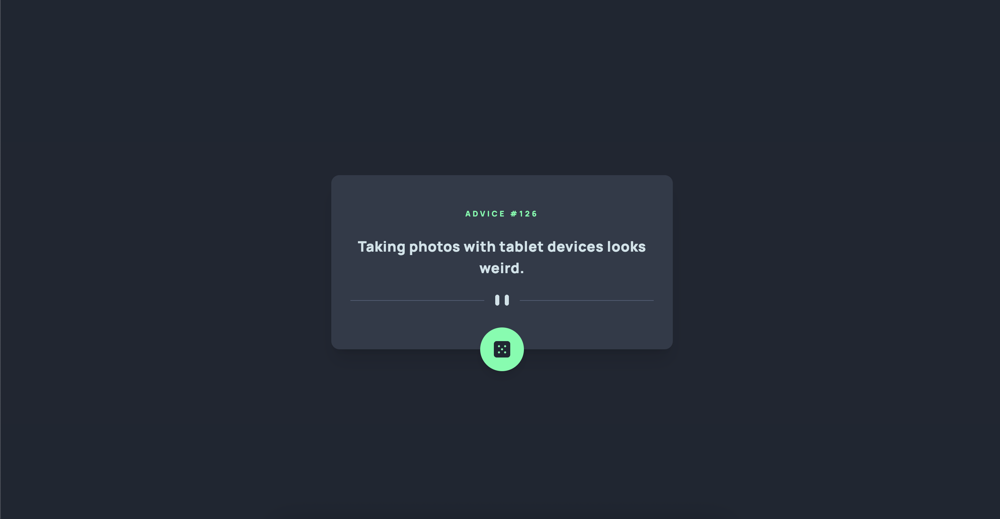

# Advice generator app

This is a simple advice generator web app built with React and TypeScript. It uses the Advice Slip API to fetch random advice quotes. The app allows users to fetch a new quote by clicking a button. The app also includes a responsive design that adapts to different screen sizes.

## Table of contents

- [Overview](#overview)
  - [The challenge](#the-challenge)
  - [Screenshot](#screenshot)
  - [Links](#links)
- [Built with](#built-with)
- [Author](#author)

## Overview

### The challenge

Users should be able to:

- View the optimal layout for the app depending on their device's screen size
- See hover states for all interactive elements on the page
- Generate a new piece of advice by clicking the dice icon

### Screenshot

### Links

- Live Site URL: [https://advice-generator-ashen-six.vercel.app/](https://advice-generator-ashen-six.vercel.app/)

## My process

### Built with

- Semantic HTML5 markup
- Mobile-first workflow
- Flexbox
- [Advice Slip](https://api.adviceslip.com/) - Public IP Address API
- [TypeScript](https://www.typescriptlang.org/) - Strongly typed javascript
- [TailwindCSS](https://https://tailwindcss.com/) - For styles
- [React](https://reactjs.org/) - JS framework
- [Tanstack Query](https://tanstack.com/query/latest) - Asynchronous state management

## Author

- Website - [Add website](https://www.your-site.com)
- Linkedin - [Gabriel Marcano](https://www.linkedin.com/in/gabriel-e-marcano/)

This is a solution to the [Advice generator app challenge on Frontend Mentor](https://www.frontendmentor.io/challenges/advice-generator-app-QdUG-13db).
